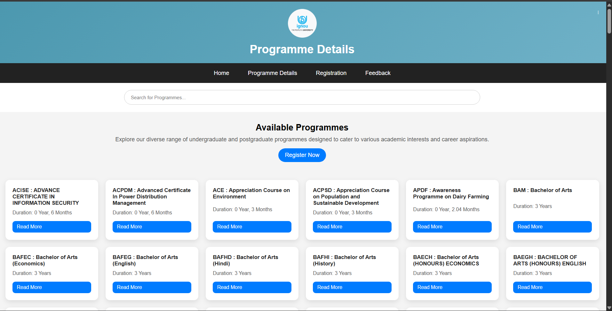
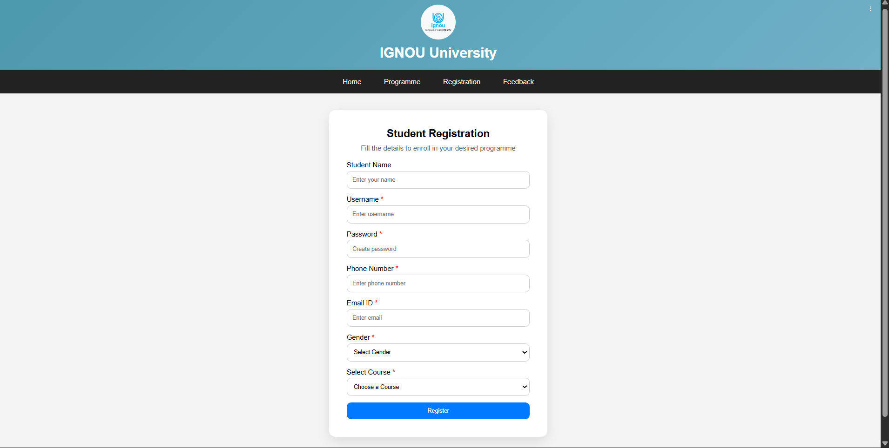
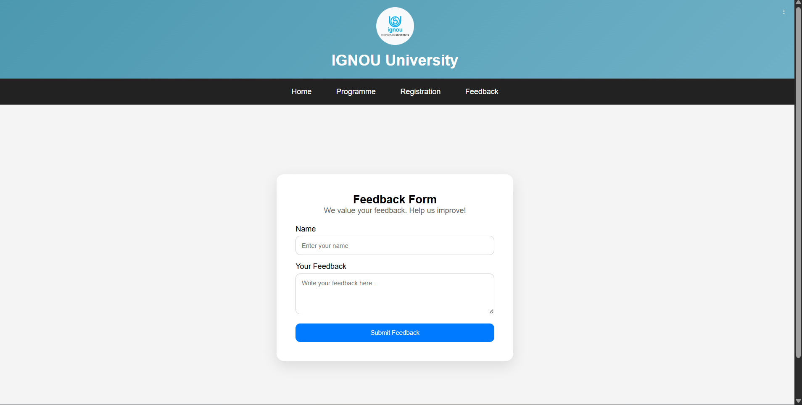
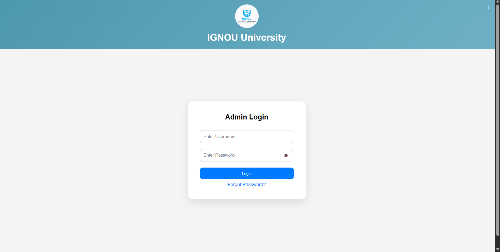
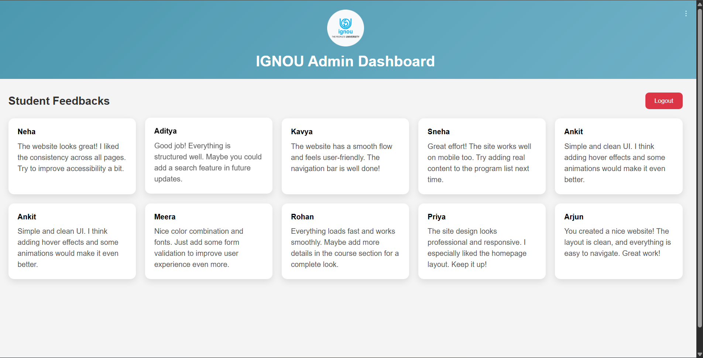
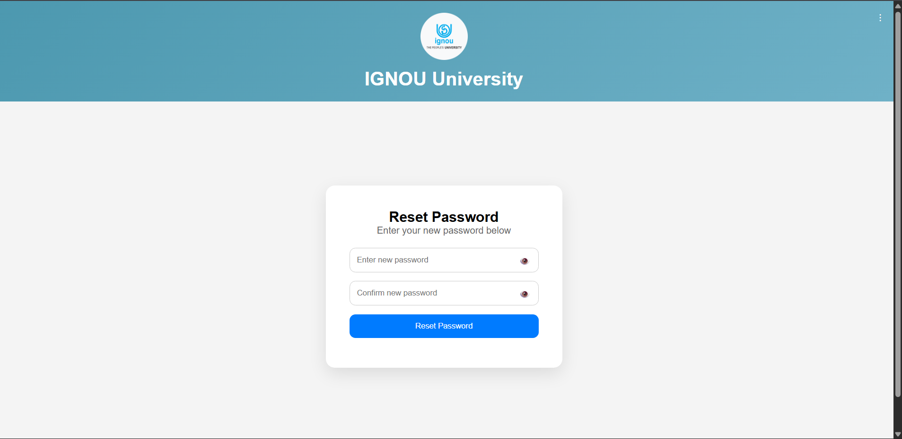

# 🎓 IGNOU University Frontend

A responsive and interactive frontend for a University Management System built using **HTML, CSS, and JavaScript**.

---

## 🚀 Live Demo

👉 https://manasomer0902.github.io/University_frontend

---

## 📌 Features

* 🏠 Home Page with university info
* 📚 Programme Details (2000+ course dataset with search & UI cards)
* 📝 Student Registration Form (validation + dynamic course loading)
* 💬 Feedback System (connected with backend API)
* 🔐 Admin Login System
* 📊 Admin Dashboard (view feedbacks securely)
* 🔁 Forgot & Reset Password UI
* 🍔 3-dot Menu Navigation
* 🔍 Search functionality
* 📱 Responsive Design

---

## 📸 Screenshots

### 🏠 Home Page


### 📚 Programme Details


### 📝 Registration


### 💬 Feedback


### 🔐 Login


### 📊 Admin Dashboard


### 🔁 Reset Password


### 🔁 Forget Password


---

## 🛠️ Tech Stack

* HTML5
* CSS3
* JavaScript (Vanilla JS)

---

## 📂 Project Structure

```bash
University_frontend/
│
├── index.html
├── login.html
├── admin.html
├── feedback.html
├── student_registration.html
├── programmedetails.html
├── forgot_password.html
├── reset_password.html
├── thankyou.html
│
├── css/
│   ├── index.css
│   ├── login.css
│   ├── feedback.css
│   ├── admin.css
|   ├── reset_password.css
|   ├── student_registration.css
|   ├── thankyou.css
│
├── js/
│   ├── config.js
│   ├── login.js
│   ├── admin.js
│   ├── feedbackform.js
│   ├── registrationform.js
│   ├── threedotmenu.js
│   ├── forgot_password.js
|   ├── programmedetails.js
|   ├── reset_password.js
|   ├── studentlist.js
│
└── images/
```

---

## ⚙️ Configuration

Create a `config.js` file:

```js
const BASE_URL = "https://uni-backend-lojc.onrender.com";
```

---

## 🧠 Key Functionalities

* Dynamic course loading from programme page
* Token-based authentication using localStorage
* API integration using Fetch API
* UI feedback system (no alerts, modern UX)

---

## 📦 How to Run Locally

1. Clone repo:

```bash
git clone https://github.com/manasomer0902/University_frontend.git
```

2. Open in browser:

```bash
Right click → Open with Live Server
```

---

## 📌 Future Improvements

* Convert to React (SPA)
* Add pagination for courses
* Improve UI animations
* Add user dashboard

---

## 👨‍💻 Author

**Manas Omer**

---

## ⭐ If you like this project

Give it a ⭐ on GitHub!
